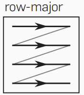
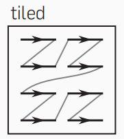
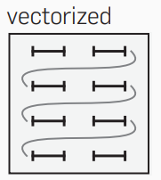
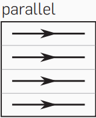

# II - Halide Scheduling Basics I

In this tutorial we will cover some of the basics of scheduling in Halide. In particular we will discuss reorder, tiling and vectorizing the brightening operation discussed in the previous tutorial. The focus of this tutorial is on single element pipelines.


## 1 Brightening Code

The brightening code is the same as before. We have wrapped the operation with timing code to evaluate the efficiency of various methods.
```{.cpp}
    //Start timing
    auto start = high_resolution_clock::now();
    Halide::Func brighter;
    Halide::Var x("x"), y("y"), c("c");
    Halide::Expr value = input(x, y, c);
    value = Halide::cast<int>(value);
    value = value + factor;
    value = Halide::min(value, 255.0f);
    value = Halide::cast<uint8_t>(value);
    brighter(x, y, c) = value;
    Halide::Buffer<uint8_t> output =
        brighter.realize({input.width(), input.height(), input.channels()});

    //Stop timing
    auto stop = high_resolution_clock::now();

```
Funcs have `print_loop_nest()` method which prints out the order of evaluation of loops. This clarifies the order of loops and will make it easier for us to understand what is going on. We will be printing this order for each section of code. 

```{.cpp}
    brighter.print_loop_nest();
```

## 2 Original Evaluation

In unmodified original execution the order of loops is channel, height, width:

```
for c:
    for y:
      for x:
```

This default unmodified execution takes 428000 microseconds on my system. 


## 3 Reorder Loops


Since image is stored in memory in row-wise fashion, the optimum way to read the image would be to read in a row wise fashion so as not to waste time skipping over row values. Since all channel values also occur together, it should form the innermost loop. For a grayscale image this order of execution looks like:




Loops can recordered by using `reorder` method.

```
brighter.reorder(c,x,y);
```

The order of execution becomes:

```
for y:
    for x:
      for c:

```

After reordering operation the takes 80294 microseconds on my system. A significant imporvement.


<br />


## 4 Tiling

Tiling operation split loops into an inner and outer loop. This is used typically in blockifying the code. By itself tiling does not do anything, however, combined with vectorization and parallelization it can induce significant speedups. It is a common strategy to reduce memory traffic by partitioning the data into subsets(tile) so that each tile fits into the shared memory. Tiling can also come in handy when the data is too big that to fit in the global memory. An important criterion is that kernel computation on these tiles can be performed independently of each other. Tiling in x and y axis looks like the following



For loops can reordered by using the `tile` method. Tiling operation for both x and y axis by grids of 4 is done by the following code block:

```
brighter.tile(x, y, x_outer, y_outer, x_inner, y_inner, 4, 4);
brighter.reorder(c,x_inner,y_inner,x_outer,y_outer);
```


The order of execution becomes:

```
for y.y_outer:
    for x.x_outer:
      for y.y_inner in [0, 3]:
        for x.x_inner in [0, 3]:
          for c:
```

As all we have done is break up a for loop, our execution time went up.


## 5 Vectorization and Parallelization

Vectorizing operation transforms such loops into sequences of vector operations. It (simplified) is the process of rewriting a loop so that instead of processing a single element of an array N times, it processes (say) 4 elements of the array simultaneously N/4 times. Vectorization looks like,




Parallelization allows for simultaneous execution of functions.



A loop can be vectorized and parallelized using the `vectorize` and `parallel` method. In our code we vectorize across the inner row iteration and parallelize across the channel.

```
brighter.split(x, x_vo, x_vi, 64).vectorize(x_vi).parallel(c);
```
In the above implementation, `split` is used to tile over a single dimensions. The split size depends on your architecture and vectorization processes the diemnsion size worth of values at a time. This number needs to be experimented with. 


The order of execution becomes:

```
parallel c:
    for y:
      for x.x_vo:
        vectorized x.x_vi in [0, 63]:
```

With all these modifications we get our best time at 72888 microseconds. 

## 6 Assignment

Try to optimize the code even further using the disucssed methods. 

## 7 References

* https://halide-lang.org/tutorials/tutorial_lesson_05_scheduling_1.html
* https://dl.acm.org/doi/10.1145/3150211 (images)


